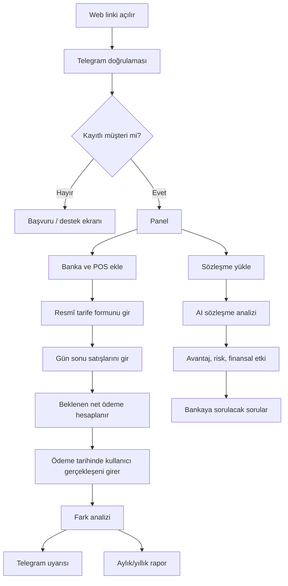

# POS Maliyet Denetim ve Sözleşme Analiz Platformu
## Uçtan Uca UX/UI ve Ürün Tasarım Dokümanı

> **Çalışma adı:** POSKontrol  
> **Ana vaat:** “POS’unuzu değil, maliyetinizi yönetin.”  
> **Hedef:** İşletmelerin banka POS kesintilerini, valörlerini, kampanyalarını ve sözleşme koşullarını sade biçimde anlamasını; beklenen ve gerçekleşen ödemeleri karşılaştırmasını; banka görüşmelerinde somut verilerle pazarlık yapmasını sağlamak.

---

# 1. Ürün Mantığı

Sistem üç temel problemi çözer:

1. İşletme hangi POS kampanyasında olduğunu ve hangi kesintilerin uygulandığını bilmiyor.
2. Gün sonu satışları ile banka hesabına yatması gereken tutar düzenli karşılaştırılmıyor.
3. Yeni sözleşme imzalanırken küçük yazılar, ücretler, taahhütler ve riskli maddeler yeterince anlaşılmıyor.

Sistem bu nedenle dört ana motor üzerine kurulmalıdır:

- **Resmî tarife kayıt motoru**
- **Günlük beklenen ödeme hesaplama motoru**
- **Gerçekleşen ödeme ve fark denetim motoru**
- **Yapay zekâ destekli sözleşme analiz motoru**

Matematiksel hesaplamalar kurallı ve deterministik olmalıdır. Yapay zekâ; yorumlama, özetleme, sınıflandırma, açıklama ve soru üretme işlerinde kullanılmalıdır.

---

# 2. Temel Kullanıcı Deneyimi İlkeleri

## 2.1. Her ekran tek iş yapmalı

Kullanıcı aynı ekranda hem banka eklememeli, hem tarife girmemeli, hem rapor okumamalıdır. Her ekranın tek amacı olmalıdır.

## 2.2. Mobil öncelikli tasarım

İşletme sahibi çoğunlukla telefondan kullanacaktır. Bu nedenle:

- Büyük dokunma alanları
- Tek sütunlu mobil düzen
- Alt sabit menü
- Sayısal girişlerde özel sayı klavyesi
- Fotoğraf çekerek belge yükleme
- Tek elle kullanılabilecek buton yerleşimi
- Karmaşık tablolar yerine kart ve özetler

## 2.3. Finans dili sadeleştirilmeli

Kullanıcıya “MDR”, “interchange”, “valör maliyeti” gibi ifadeler tek başına gösterilmemelidir.

Örnek:

- “Valör: 3 gün”
- “Bu satışın hesabınıza geçmesi beklenen tarih: 16 Ağustos”
- “Beklenen net ödeme: 33.742,50 TL”
- “Hesabınıza geçen: 33.515,00 TL”
- “Fark: 227,50 TL daha düşük”

## 2.4. Kırmızı yalnızca gerçek riskte kullanılmalı

- Yeşil: Uyumlu
- Turuncu: Kontrol edilmeli
- Kırmızı: Beklenenden düşük ödeme / kritik sözleşme maddesi
- Mavi: Bilgilendirme
- Gri: Henüz veri yok

## 2.5. Kullanıcıya suçlayıcı ifade gösterilmemeli

“Banka hatalı kesti” yerine:

> “Sözleşmede kayıtlı koşullara göre beklenen tutar ile hesaba geçen tutar arasında 227,50 TL fark bulunuyor.”

---

# 3. Kullanıcı Rolleri

## 3.1. İşletme sahibi

- Banka ve POS ekler
- Tarife bilgilerini girer
- Gün sonu satışlarını kaydeder
- Hesaba geçen tutarları doğrular
- Sözleşme yükler
- Rapor alır

## 3.2. Firma yöneticisi

- Birden fazla şube ve kullanıcıyı yönetir
- Tüm bankaları ve POS’ları görür
- Yıllık maliyet raporu alır
- Kullanıcı yetkilerini belirler

## 3.3. Muhasebe personeli

- Gün sonu ve ödeme girişi yapar
- Belgeleri yükler
- Raporları görüntüler
- Kritik ayarları değiştiremez

## 3.4. Sistem yöneticisi

- Müşteri hesabı açar
- Telegram hesabını eşleştirir
- Firma durumunu aktif/pasif yapar
- Paket ve abonelikleri yönetir
- Sistem genelindeki veri kalitesi uyarılarını görür

---

# 4. Telegram Zorunlu Giriş ve Müşteri Eşleştirme

## 4.1. Giriş mantığı

Web sayfası doğrudan kullanıcı adı ve şifre ile açılmamalıdır.

Akış:

1. Kullanıcı kendisine gönderilen web bağlantısını açar.
2. Karşılama ekranında **“Telegram ile Doğrula”** butonuna basar.
3. Telegram botu açılır.
4. Bot kullanıcıya şu bilgiyi gösterir:
   - Firma adı
   - Giriş yapılan cihaz
   - Tarih ve saat
   - “Bu giriş size mi ait?”
5. Kullanıcı **Onayla** veya **Reddet** seçer.
6. Onay sonrası web oturumu açılır.
7. Telegram hesabı sistemde kayıtlı değilse panel açılmaz.

## 4.2. Kayıtlı olmayan kullanıcı ekranı

Başlık:

> Bu hesap henüz bir firma ile eşleştirilmemiş.

Butonlar:

- Başvuru Oluştur
- Destek ile İletişime Geç
- Farklı Telegram Hesabı Kullan

## 4.3. İlk eşleştirme

Müşteri sisteme alındığında yönetici:

- Firma kaydı oluşturur
- Yetkili telefon numarasını kaydeder
- Telegram botundan tek kullanımlık eşleştirme kodu gönderir
- Kullanıcı kodu onaylar
- Telegram kullanıcı kimliği firma hesabına bağlanır

## 4.4. Güvenlik kuralları

- Yeni cihaz girişi Telegram onayı gerektirir
- Kritik ayar değişiklikleri Telegram onayı gerektirir
- Tarife silme ve kullanıcı ekleme işlemlerinde ikinci onay gerekir
- Oturum süresi dolduğunda yeniden doğrulama yapılır
- Kullanıcı reddederse web oturumu hemen kapatılır

---

# 5. Bilgi Mimarisi

## Mobil alt menü

1. Ana Sayfa
2. Gün Sonu
3. Ödemeler
4. Analiz
5. Menü

## Masaüstü sol menü

- Genel Bakış
- Bankalar ve POS’lar
- Tarifeler
- Gün Sonu Girişi
- Beklenen Ödemeler
- Gerçekleşen Ödemeler
- Fark Analizi
- Sözleşme Analizi
- Raporlar
- Finans Asistanı
- Bildirimler
- Kullanıcılar
- Ayarlar

---

# 6. İlk Kurulum Akışı

İlk girişte kullanıcı boş bir panel görmemelidir. Beş adımlık kurulum sihirbazı açılmalıdır.

## Adım 1 — Firma bilgileri

Alanlar:

- Firma unvanı
- Kısa firma adı
- Vergi numarası
- Yetkili kişi
- Telefon
- E-posta
- İl
- İlçe
- Sektör
- Yıllık yaklaşık POS cirosu
- Şube sayısı

## Adım 2 — Banka ekleme

- Banka seçimi
- Şube adı
- Müşteri numarası
- Banka yetkilisi
- Yetkili telefon/e-posta
- Not

## Adım 3 — POS ekleme

- POS türü: Fiziksel / Sanal / Mobil / QR
- POS adı
- Terminal numarası
- Üye işyeri numarası
- Şube
- Aktiflik durumu
- Bağlı banka hesabı

## Adım 4 — Resmî tarife girişi

Kullanıcıya şu açıklama gösterilir:

> Bankanız tarafından doldurulmuş ve kaşelenmiş POS Bilgi Formundaki verileri bu ekrana bir kez girin. Sistem tüm hesaplamaları bu resmî bilgiler üzerinden yapacaktır.

## Adım 5 — İlk kontrol

- Banka
- POS
- Tek çekim oranı
- Taksit oranları
- Valör
- Ek ücretler
- Tarife başlangıç tarihi
- Belge görüntüsü

Buton:

> Bilgileri Onayla ve Sistemi Başlat

---

# 7. Ana Panel Tasarımı

## 7.1. Üst bölüm

Karşılama:

> Günaydın, Şenol Bey  
> Bugün takip etmeniz gereken 2 ödeme bulunuyor.

Sağ bölüm:

- Bildirim
- Firma seçici
- Profil
- Hızlı işlem butonu

## 7.2. Ana özet kartları

### Kart 1 — Bugün beklenen ödeme

- Büyük rakam
- Hangi bankalardan geleceği
- Kaç ödeme olduğu
- “Detayı Gör”

### Kart 2 — Bugün hesaba geçen

- Gerçekleşen toplam
- Beklenenle fark
- Son güncelleme saati

### Kart 3 — Bu ay toplam kesinti

- Komisyon
- Ek ücret
- Valör maliyeti
- Önceki aya göre değişim

### Kart 4 — Kontrol edilmesi gereken fark

- Fark bulunan işlem sayısı
- Toplam fark tutarı
- En yüksek fark görülen banka

## 7.3. Hızlı işlemler

Yalnızca dört buton:

- Gün Sonu Gir
- Hesaba Geçeni Gir
- Yeni POS Ekle
- Sözleşme Analiz Et

## 7.4. Bekleyen ödemeler listesi

Satır:

- Tarih
- Banka
- POS
- Beklenen tutar
- Durum
- “Ödeme Geldi” butonu

## 7.5. Akıllı özet alanı

> Bu ay toplam 1.245.000 TL POS satışı yaptınız. Kayıtlı tarifelere göre 31.420 TL kesinti bekleniyordu. Gerçekleşen toplam kesinti 33.870 TL oldu. 2.450 TL fark kontrol edilmeli.

---

# 8. Bankalar ve POS’lar Ekranı

## 8.1. Banka kartı

Her banka kartında:

- Banka logosu
- Banka adı
- Aktif POS sayısı
- Aylık ciro
- Ortalama komisyon oranı
- Bekleyen ödeme
- Uyarı durumu

Butonlar:

- Bankayı Aç
- Yeni POS Ekle
- Tarife Görüntüle

## 8.2. Banka detay ekranı

Sekmeler:

- Genel
- POS’lar
- Tarifeler
- Ödemeler
- Belgeler
- Raporlar

## 8.3. POS kartı

- POS adı
- Terminal numarası
- Tür
- Aktif tarife
- Son işlem tarihi
- Bu ay ciro
- Bu ay kesinti
- Durum etiketi

---

# 9. Resmî Tarife Formunun Dijital Karşılığı

Tarife girişi tek uzun form olarak gösterilmemelidir. Sekiz kısa adıma bölünmelidir.

## Bölüm 1 — Kimlik bilgileri

- Banka
- POS
- Üye işyeri numarası
- Terminal numarası
- Kampanya/tarife adı
- Tarife başlangıç tarihi
- Tarife bitiş tarihi
- Banka yetkilisi
- Belge tarihi

## Bölüm 2 — Tek çekim oranları

- Ertesi gün ödeme oranı
- 2 gün valör oranı
- 7 gün valör oranı
- Blokeli çalışma koşulu
- Yabancı kart oranı
- Ticari kart oranı

## Bölüm 3 — Taksit oranları

Her taksit için ayrı satır:

- 2 taksit
- 3 taksit
- 4 taksit
- 5 taksit
- 6 taksit
- 7 taksit
- 8 taksit
- 9 taksit
- 10 taksit
- 11 taksit
- 12 taksit

Her satırda:

- Komisyon oranı
- Valör günü
- Sabit ücret
- Özel kampanya adı
- Geçerlilik tarihi

## Bölüm 4 — Kart ve işlem türleri

- Bankanın kendi kartı
- Diğer banka kartı
- Ticari kart
- Yurt dışı kart
- Puan kullanımı
- İade işlemi
- İptal işlemi
- Mail order
- Temassız
- QR

## Bölüm 5 — Sabit ücretler

- Aylık POS ücreti
- Cihaz bakım ücreti
- Hat/SIM ücreti
- Ekstre ücreti
- Yazılım ücreti
- Hareketsizlik ücreti
- Minimum ciro cezası
- Erken fesih ücreti
- Diğer ücret

## Bölüm 6 — Valör ve ödeme

- Ödeme günü
- Tatil günlerinde ödeme kuralı
- Hafta sonu işlemlerinin ödeme günü
- Parçalı ödeme kuralı
- Bloke süresi
- Bloke çözüm koşulu

## Bölüm 7 — Taahhütler

- Aylık ciro taahhüdü
- Yıllık ciro taahhüdü
- Ürün kullanım taahhüdü
- Maaş anlaşması bağlantısı
- Kredi bağlantısı
- Otomatik ödeme talimatı
- Taahhüt ihlal bedeli

## Bölüm 8 — Belge ve onay

- Banka tarafından doldurulan formun fotoğrafı/PDF’i
- Kaşe mevcut mu?
- İmza mevcut mu?
- Kullanıcı doğrulaması
- Notlar
- Tarife sürüm numarası

## Tarife sürümleme

Tarife değiştirildiğinde eski kayıt silinmemelidir.

Örnek:

- Tarife v1 — 01.01.2026–31.03.2026
- Tarife v2 — 01.04.2026–30.06.2026
- Tarife v3 — 01.07.2026–devam ediyor

Hesaplama motoru işlem tarihine göre doğru tarife sürümünü kullanmalıdır.

---

# 10. Gün Sonu Giriş Ekranı

Bu ekran sistemin en hızlı kullanılan ekranı olmalıdır.

## 10.1. Üst seçim

- Tarih
- Şube
- Banka
- POS

Varsayılan olarak son kullanılan POS seçili gelsin.

## 10.2. Satış satırları

Her satır:

- İşlem türü
- Toplam tutar
- İşlem adedi
- Kart türü
- Not

Hazır işlem türleri:

- Tek çekim
- 2 taksit
- 3 taksit
- 4 taksit
- 5 taksit
- 6 taksit
- 7 taksit
- 8 taksit
- 9 taksit
- 10 taksit
- 11 taksit
- 12 taksit
- Yabancı kart
- Ticari kart
- İade
- İptal

## 10.3. Hızlı giriş örneği

- Tek çekim: 10.000 TL
- 6 taksit: 25.000 TL

Kullanıcı **Hesapla** butonuna bastığında:

- Brüt satış
- Beklenen komisyon
- Sabit ücret
- Beklenen net ödeme
- Beklenen ödeme tarihi
- Kullanılan tarife

gösterilir.

## 10.4. Kaydetme sonrası mesaj

> Gün sonu kaydedildi.  
> 10.000 TL tek çekim satışın 13 Ağustos’ta, 25.000 TL 6 taksitli satışın 15 Ağustos’ta hesabınıza geçmesi bekleniyor.

---

# 11. Hesaplama Motoru

## 11.1. Temel formül

**Beklenen net ödeme = Brüt satış − komisyon − sabit ücret − diğer kayıtlı kesintiler**

## 11.2. Ödeme tarihi

Ödeme tarihi hesaplanırken:

- İşlem tarihi
- Valör günü
- Hafta sonu
- Resmî tatil
- Bankanın tatil kuralı
- Kampanya dönemi
- Bloke koşulu

dikkate alınmalıdır.

## 11.3. Yapay zekâ kullanılmaması gereken alanlar

- Komisyon matematiği
- Tarih hesaplama
- Tutar karşılaştırma
- Tarife sürümü seçimi
- Rapor toplamları

## 11.4. Yapay zekânın kullanılacağı alanlar

- Belge sınıflandırma
- Sözleşme maddesi özetleme
- Farkın olası nedenini açıklama
- Bankaya sorulacak soruları hazırlama
- Kullanıcıya sade dilde açıklama
- Eksik veri uyarısı
- Sektörel karşılaştırmayı yorumlama

---

# 12. Beklenen Ödemeler Ekranı

Filtreler:

- Bugün
- Yarın
- Bu hafta
- Geciken
- Banka
- POS
- Şube

Her ödeme kartında:

- Banka
- POS
- Satış tarihi
- Ödeme tarihi
- Brüt satış
- Beklenen kesinti
- Beklenen net ödeme
- Durum

Durumlar:

- Bekleniyor
- Bugün yatmalı
- Gecikti
- Kısmi ödeme
- Tam ödendi
- Fark bulundu

Ana buton:

> Hesabıma Geçti

---

# 13. Gerçekleşen Ödeme Girişi

Kullanıcı ödeme kartını açar ve yalnızca şu bilgileri girer:

- Hesaba geçen tutar
- Geçiş tarihi
- Banka açıklaması
- İsteğe bağlı dekont/ekstre görüntüsü

Sistem otomatik olarak:

- Beklenen tutarı getirir
- Farkı hesaplar
- Fark yüzdesini hesaplar
- Gecikme gününü hesaplar
- İlgili tarife maddesini gösterir

## Sonuç mesajı örnekleri

### Uyumlu

> Ödeme beklenen tutarla uyumlu. 0,80 TL yuvarlama farkı var.

### Kontrol edilmeli

> Hesabınıza beklenenden 227,50 TL daha az geçti. Fark, 6 taksit komisyon oranının kayıtlı tarifeden yüksek uygulanmış olmasından kaynaklanabilir.

### Gecikmiş

> Ödeme kayıtlı valöre göre 2 iş günü gecikmiş görünüyor.

---

# 14. Fark Analizi Merkezi

Üç seviyeli analiz:

## Seviye 1 — Matematiksel fark

- Beklenen
- Gerçekleşen
- Fark
- Fark yüzdesi

## Seviye 2 — Kural kontrolü

- Kullanılan tarife
- Beklenen oran
- Uygulanan yaklaşık oran
- Valör uyumu
- Ek ücret uyumu

## Seviye 3 — Yapay zekâ açıklaması

- Olası neden
- Kontrol edilmesi gereken belge
- Bankaya sorulacak soru
- Risk seviyesi
- Önerilen işlem

Örnek:

> Kayıtlı tarifede 6 taksit oranı %3,10. Gerçekleşen ödeme yaklaşık %3,76 kesintiye karşılık geliyor. Aradaki fark; ticari kart farkı, ek kampanya bedeli veya farklı tarife uygulanmasından kaynaklanabilir. Bankanızdan işlem bazlı komisyon dökümü isteyin.

---

# 15. Sözleşme Analiz Merkezi

Bu modül, kullanıcı yeni POS alırken veya yeni banka sözleşmesi imzalarken kullanılacaktır.

## 15.1. Yükleme seçenekleri

- PDF yükle
- Kamerayla fotoğraf çek
- Birden fazla sayfa yükle
- Banka e-postasından gelen belgeyi ekle
- Mevcut sözleşmeyle karşılaştır

## 15.2. İşlem aşamaları

1. Belge alındı
2. Sayfalar düzenleniyor
3. Metinler okunuyor
4. Finansal maddeler bulunuyor
5. Riskler sınıflandırılıyor
6. Özet hazırlanıyor

## 15.3. Sonuç ekranı

### A. 60 saniyelik özet

> Bu sözleşme 24 ay taahhüt içeriyor. Aylık 750.000 TL ciro hedefi bulunuyor. Hedefin altında kalınırsa aylık 2.500 TL ücret uygulanabilir. Tek çekim oranı avantajlı; ancak ticari kart ve erken fesih koşulları dikkat gerektiriyor.

### B. Avantajlar

- Tek çekim oranı mevcut tarifeden düşük
- İlk üç ay cihaz ücreti alınmıyor
- Ertesi gün ödeme avantajı
- Belirli kartlarda kampanya desteği

### C. Dikkat edilmesi gerekenler

- Ciro taahhüdü
- Erken fesih bedeli
- Ticari kart ek oranı
- Valör değişiklik yetkisi
- Tek taraflı tarife güncelleme maddesi
- Ek ürün zorunluluğu
- Otomatik yenileme
- İade ve ters ibraz koşulları

### D. Finansal etki

- Tahmini aylık maliyet
- Tahmini yıllık maliyet
- Mevcut sözleşmeye göre fark
- Ciro taahhüdü tutmazsa maliyet
- Erken ayrılma senaryosu

### E. Bankaya sorulması gereken sorular

Örnek:

1. Ticari kart işlemlerinde ek komisyon var mı?
2. Ciro taahhüdü hangi işlem türlerini kapsıyor?
3. Oranlar hangi koşullarda tek taraflı değiştirilebilir?
4. POS iptalinde cihaz, yazılım veya fesih bedeli var mı?
5. Hafta sonu işlemlerinin ödeme günü nedir?
6. Kampanya sona erdiğinde varsayılan oran ne olacaktır?

### F. Şerh/düzeltme önerileri

Sistem hukukî karar vermemeli, ancak şu formatta destek sunmalıdır:

> “Bu maddede ücret tutarı açıkça yazılmamış. İmzadan önce sabit tutarın sözleşmeye eklenmesini talep edin.”

## 15.4. Güvenlik metni

> Bu analiz karar desteği amacıyla hazırlanır. Hukukî veya finansal danışmanlık yerine geçmez. Kritik sözleşmeler için uzman görüşü alınmalıdır.

---

# 16. Mevcut ve Yeni Sözleşme Karşılaştırması

İki sütunlu sade ekran:

| Başlık | Mevcut | Yeni |
|---|---:|---:|
| Tek çekim oranı | %2,45 | %2,20 |
| 6 taksit oranı | %4,10 | %4,35 |
| Valör | 1 gün | 2 gün |
| Aylık cihaz ücreti | 250 TL | 0 TL |
| Ciro taahhüdü | Yok | 750.000 TL |
| Erken fesih | Yok | 15.000 TL |

Alt sonuç:

> Yeni teklif tek çekimde avantajlı, ancak taksitli satış ve ciro taahhüdü nedeniyle toplam yıllık maliyet mevcut sözleşmeden daha yüksek olabilir.

---

# 17. Yıllık Maliyet ve Pazarlık Raporu

Bu rapor ürünün en güçlü çıktısıdır.

## 17.1. Kapak

- Firma adı
- Rapor dönemi
- Bankalar
- Toplam POS cirosu
- Toplam kesinti
- Sistem logosu

## 17.2. Yönetici özeti

> Son 12 ayda 18.450.000 TL POS cirosu oluştu. Toplam 512.450 TL kesinti gerçekleşti. Kayıtlı tarifelere göre beklenen kesinti 468.300 TL idi. 44.150 TL tutarındaki fark kontrol edilmelidir.

## 17.3. Banka bazlı karşılaştırma

- Ciro
- Ortalama oran
- Toplam kesinti
- Beklenen kesinti
- Fark
- Ortalama valör
- Sabit ücret

## 17.4. POS bazlı analiz

- En yüksek maliyetli POS
- En düşük maliyetli POS
- En fazla fark görülen POS
- En yüksek taksit maliyeti

## 17.5. Gelecek yıl tahmini

> Mevcut koşullar ve benzer ciro ile gelecek 12 ay tahmini POS maliyeti: 548.000 TL.

## 17.6. Pazarlık özeti

- Talep edilebilecek oran aralığı
- Kaldırılması istenebilecek sabit ücretler
- Valör iyileştirme fırsatı
- Ciro taahhüdü riski
- Bankaya sunulacak kısa görüşme metni

## 17.7. Tarafsız dil

Rapor:

- “Hatalı kesinti” dememeli
- “Kayıtlı koşullarla uyumsuz görünüyor” demeli
- Kaynak belge ve tarih göstermeli
- Kullanıcı girdisi ile banka belgesini ayırmalı

---

# 18. Sektör ve Benzer İşletme Karşılaştırması

Kullanıcılar anonim ve toplulaştırılmış verilerle kıyaslanabilir.

Kriterler:

- Sektör
- İl
- Ciro aralığı
- Şube sayısı
- Taksit oranı
- Fiziksel/sanal POS
- Banka

Ekran örneği:

> Sizin ortalama komisyon oranınız: %3,20  
> Benzer işletmelerin medyanı: %2,68  
> Aradaki tahmini yıllık maliyet farkı: 36.500 TL

Gizlilik:

- Firma adı gösterilmez
- Kişisel ve ticari ham veriler paylaşılmaz
- Minimum örneklem sayısı olmadan karşılaştırma gösterilmez
- Sonuçlar “pazar göstergesi” olarak sunulur

---

# 19. Finans Asistanı

Kullanıcı doğal dilde soru sorabilir:

- Bu ay neden fazla kesinti olmuş?
- Hangi bankam daha pahalı?
- 6 taksitli satışları hangi POS’tan geçmem daha avantajlı?
- Yarın hesabıma ne kadar para yatacak?
- Bu sözleşmede en riskli üç madde nedir?
- Bankayla görüşürken ne istemeliyim?
- Son 12 ayda valör nedeniyle tahmini maliyetim ne kadar?

Yanıt yapısı:

1. Net cevap
2. Hesabın dayandığı veri
3. Olası risk
4. Önerilen kontrol
5. İlgili ekrana git butonu

---

# 20. Bildirim Sistemi

## Telegram bildirimleri

- Yarın beklenen ödeme
- Ödeme bugün yatmalı
- Beklenen tutardan düşük ödeme
- Geciken ödeme
- Tarife bitiş tarihi
- Kampanya bitiş tarihi
- Sözleşme taahhüt uyarısı
- Aylık rapor hazır
- Yeni cihazdan giriş onayı
- Kritik ayar değişikliği

Örnek Telegram mesajı:

> **Ödeme Uyarısı**  
> Akbank POS-01 için bugün 33.742,50 TL ödeme bekleniyor.  
> Hesabınıza geçen tutarı kaydetmek için dokunun.

Butonlar:

- Ödeme Geldi
- Daha Sonra Hatırlat
- Paneli Aç

---

# 21. Yönetici Paneli

## 21.1. Müşteriler

- Firma
- Paket
- Telegram eşleşmesi
- Son giriş
- Aktif banka sayısı
- Aktif POS sayısı
- Abonelik durumu
- Destek durumu

## 21.2. Firma detay

- Kullanıcılar
- Bankalar
- POS’lar
- Tarife kayıtları
- Veri giriş sıklığı
- Son rapor
- Kritik uyarılar
- Telegram geçmişi

## 21.3. Destek araçları

- Telegram eşleştirmeyi yenile
- Kullanıcıyı pasife al
- Firma yöneticisi ata
- Tarife girişini kontrol et
- Eksik veri uyarısı gönder
- Paket değiştir
- Deneme süresi tanımla

---

# 22. Responsive Tasarım Kuralları

## Mobil

- Tek sütun
- Alt sabit menü
- Kartlar ekran genişliğinde
- Ana rakamlar 28–32 px
- Buton yüksekliği minimum 48 px
- Form alanları tek tek
- Tablolar kart listesine dönüşür
- Belge yükleme kamera odaklı
- “Kaydet” butonu ekran altında sabit

## Tablet

- İki sütunlu kartlar
- Sol menü daraltılabilir
- Form özetleri sağ panelde

## Masaüstü

- 240–260 px sol menü
- 12 kolon grid
- Özet kartları dört sütun
- Detay ekranlarında sağ yardımcı panel
- Karşılaştırmalarda tablo ve grafik
- Hızlı işlem menüsü üst sağda

---

# 23. Görsel Tasarım Sistemi

## 23.1. Stil

- Güven veren
- Kurumsal ama soğuk olmayan
- Finansal teknoloji hissi
- Gereksiz gölge ve parlak efekt yok
- Büyük boşluklar
- Temiz tipografi
- Yoğun tablo yerine özet kartları

## 23.2. Renkler

- Ana lacivert: `#11213A`
- Ana mavi: `#2F6BFF`
- Açık arka plan: `#F5F7FB`
- Kart: `#FFFFFF`
- Başarı: `#16875B`
- Uyarı: `#D97706`
- Kritik: `#C43D3D`
- Metin: `#162033`
- İkincil metin: `#667085`
- Kenarlık: `#E4E7EC`

## 23.3. Tipografi

- Inter veya Manrope
- Başlık: 600–700 ağırlık
- Gövde: 400–500
- Finansal rakamlar: tabular numbers
- Mobilde minimum 15–16 px gövde metni

## 23.4. Bileşenler

- Primary Button
- Secondary Button
- Danger Button
- Stat Card
- Bank Card
- POS Card
- Payment Card
- Alert Banner
- Stepper
- Drawer
- Bottom Sheet
- File Upload
- AI Result Card
- Comparison Table
- Status Badge
- Empty State
- Skeleton Loading
- Confirmation Modal
- Telegram Approval State

---

# 24. Ekran Wireframe’leri

## 24.1. Mobil ana sayfa

```text
┌──────────────────────────────┐
│ POSKontrol          🔔   👤  │
│ Günaydın, Şenol Bey          │
│ 2 ödeme bugün kontrol edilmeli│
├──────────────────────────────┤
│ Bugün Beklenen               │
│ 33.742,50 TL                 │
│ 2 ödeme                      │
├──────────────────────────────┤
│ Hesaba Geçen                 │
│ 33.515,00 TL                 │
│ 227,50 TL düşük              │
├──────────────────────────────┤
│ [ Gün Sonu Gir ]             │
│ [ Ödeme Kaydet ]             │
│ [ Sözleşme Analiz Et ]       │
├──────────────────────────────┤
│ Bekleyen Ödemeler            │
│ Akbank POS-01  13.742,50 TL  │
│ Yapı Kredi      20.000,00 TL │
├──────────────────────────────┤
│ Ana  GünSonu  Ödeme  Analiz  │
└──────────────────────────────┘
```

## 24.2. Masaüstü ana sayfa

```text
┌──────────────┬──────────────────────────────────────────────┐
│ POSKontrol   │ Günaydın, Şenol Bey              🔔  Firma ▼│
│              ├──────────┬──────────┬──────────┬────────────┤
│ Genel Bakış  │ Beklenen │ Geçen    │ Kesinti │ Fark       │
│ Bankalar     │ 33.742   │ 33.515   │ 4.280   │ 227,50 TL  │
│ POS’lar      ├───────────────────────────────┬──────────────┤
│ Tarifeler    │ Bekleyen Ödemeler             │ Hızlı İşlem │
│ Gün Sonu     │ Akbank ...                     │ Gün Sonu    │
│ Ödemeler     │ Yapı Kredi ...                 │ Ödeme Gir   │
│ Analiz       │                                │ Sözleşme    │
│ Sözleşmeler  ├───────────────────────────────┴──────────────┤
│ Raporlar     │ Aylık Maliyet ve Fark Grafiği               │
│ Ayarlar      │                                              │
└──────────────┴──────────────────────────────────────────────┘
```

## 24.3. Gün sonu ekranı

```text
Tarih: [ 12.08.2026 ]
Şube:  [ Merkez ▼ ]
Banka: [ Akbank ▼ ]
POS:   [ POS-01 ▼ ]

Satışlar
--------------------------------
Tek çekim       [ 10.000,00 TL ]
6 taksit        [ 25.000,00 TL ]
+ Satış Türü Ekle

Beklenen Sonuç
Brüt satış:        35.000,00 TL
Komisyon:           1.257,50 TL
Net ödeme:         33.742,50 TL
Ödeme tarihi:      13.08.2026

[ Gün Sonunu Kaydet ]
```

## 24.4. Sözleşme analiz sonucu

```text
Belge: Akbank POS Teklifi.pdf
Durum: Analiz tamamlandı

Genel değerlendirme: DİKKAT

[ 60 Saniyelik Özet ]
[ Avantajlar 4 ]
[ Dikkat Edilecekler 6 ]
[ Finansal Etki ]
[ Bankaya Sorulacaklar ]
[ Mevcut Teklifle Karşılaştır ]

En kritik madde:
24 ay taahhüt ve 15.000 TL erken fesih bedeli.

[ Yönetici Özeti Oluştur ]
```

---

# 25. Boş, Hata ve Yüklenme Durumları

## Boş panel

> Henüz bir POS eklenmedi. İlk bankanızı ve POS’unuzu ekleyerek başlayın.

## Eksik tarife

> Bu POS için aktif tarife bulunmuyor. Beklenen ödeme hesaplanamaz.

## Belirsiz sözleşme maddesi

> Bu sayfadaki metin net okunamadı. Daha yakın bir fotoğraf yükleyin veya maddeyi elle girin.

## Fark bulunamadı

> Ödeme kayıtlı koşullarla uyumlu görünüyor.

## Sistem hatası

> İşleminiz kaydedilemedi. Girdiğiniz bilgiler silinmedi. Tekrar deneyin.

---

# 26. Veri Modeli Özeti

Ana tablolar:

- companies
- company_users
- telegram_accounts
- login_approvals
- branches
- banks
- bank_contacts
- pos_devices
- tariff_versions
- tariff_single_payment_rates
- tariff_installment_rates
- tariff_fees
- tariff_commitments
- tariff_documents
- daily_sales
- daily_sales_items
- expected_payments
- actual_payments
- payment_differences
- contracts
- contract_pages
- contract_analysis
- contract_risks
- contract_questions
- reports
- notifications
- audit_logs

Her finansal kayıtta bulunması gereken alanlar:

- company_id
- branch_id
- bank_id
- pos_id
- tariff_version_id
- created_by
- created_at
- source_type
- source_document_id
- verification_status

---

# 27. Denetim ve Kayıt Güvenliği

- Silme yerine pasife alma
- Tarife sürüm geçmişi
- Kim neyi değiştirdi kaydı
- Belge ile veri ilişkilendirme
- Kullanıcı tarafından doğrulandı etiketi
- Banka tarafından verildi etiketi
- Yapay zekâ tarafından çıkarıldı etiketi
- Manuel düzenlendi etiketi
- Rapor üzerinde veri kaynağı gösterimi

---

# 28. MVP Sıralaması

## Faz 1 — Çekirdek sistem

- Telegram giriş/onay
- Firma, banka, POS
- Tarife girişi
- Gün sonu girişi
- Beklenen ödeme
- Gerçekleşen ödeme
- Fark hesabı
- Basit PDF rapor

## Faz 2 — Akıllı analiz

- Sözleşme yükleme
- AI özet
- Risk ve avantaj analizi
- Bankaya sorulacak sorular
- Mevcut/yeni sözleşme karşılaştırma
- Telegram bildirimleri

## Faz 3 — Karar destek

- Yıllık pazarlık raporu
- Sektör karşılaştırması
- Finans asistanı
- Şube ve ekip yönetimi
- Gelişmiş grafikler
- Abonelik sistemi

---

# 29. Başarı Kriterleri

- İlk POS kurulumu 10 dakikadan kısa sürmeli
- Gün sonu girişi 30–60 saniye sürmeli
- Ödeme doğrulaması 15 saniyeden kısa sürmeli
- Kullanıcı ana ekranda 5 saniye içinde farkı anlamalı
- Mobilde yatay kaydırma gerekmemeli
- Tarife olmadan hesaplama yapılmamalı
- Hesaplama sonucu hangi tarife sürümüne dayandığını göstermeli
- Kritik işlemler Telegram onaylı olmalı
- AI sonucu kesin hüküm değil, karar desteği olarak sunulmalı

---

# 30. Ürün İçindeki Ana Mesajlar

## Ana slogan

> POS’unuzu değil, maliyetinizi yönetin.

## Alt mesaj

> Günlük satışlarınızı girin, hesabınıza ne kadar ve ne zaman para yatması gerektiğini görün.

## Sözleşme modülü

> İmzalamadan önce neye imza attığınızı anlayın.

## Yıllık rapor

> Banka görüşmesine tahminle değil, verilerle gidin.

## Güven mesajı

> Hesaplamalar kayıtlı banka tarifenize göre yapılır. Yapay zekâ sonuçları açıklamak ve karar desteği sunmak için kullanılır.

---

# 31. Son Ürün Akışı



---

# 32. Son Not

Bu ürünün ana değeri “komisyon hesaplamak” değildir. Ana değer; işletmenin bankayla arasındaki finansal ilişkiyi kayıt altına almak, günlük kontrol etmek, anlaşılır hâle getirmek ve pazarlık gücünü artırmaktır.
